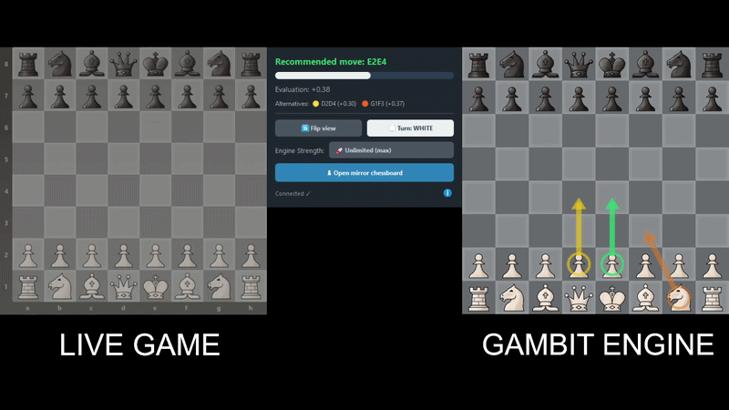

# ♞ Gambit Engine

Stockfish-based chess analysis tool for visualizing evaluations and variations from a single board position.

  



---

## ✨ Features

- 🔍 **Detection and import of the chessboard position**
- 🧠 **Stockfish analysis** with generation of the best variations (MultiPV):
  - 🟢 green arrow = best move
  - 🟡 yellow arrow = second-best move
  - 🟠 orange arrow = third-best move
- 🚀 **Engine strength control (ELO simulation)** for educational analysis
- 📊 **Evaluation bar** with graphical display and numeric score
- ♻️ **Automatic detection of turn and orientation** with manual correction
- 🖥 **Graphical interface** for studying and analyzing chess positions

## 🔧 Requirements

- **Windows** 10/11
- **Python 3.10+**
- **Stockfish** executable

## 📦 Installation

1. **Create a virtual environment** and install dependencies:

   ```powershell
   python -m venv .venv
   .\.venv\Scripts\Activate.ps1
   pip install -r requirements.txt
   ```

3. **Check Stockfish path**: if you use a different executable, update `STOCKFISH_PATH` in `config.py`.
   You can download the latest version from [stockfishchess.org](https://stockfishchess.org/download/).

## ⚙️ Configuration (`config.py`)

| Parameter | Default | Description |
|---|---|---|
| `TEMPO_ANALYSIS` | `0.25` | Engine thinking time per position |
| `MULTIPV` | `3` | Number of best variations displayed |
| `READ_INTERVAL` | `0.4` | Time between board reads |
| `ENGINE_HASH_MB` | `64` | Engine hash memory (MB) |
| `ENGINE_THREADS` | `2` | Number of engine threads |
| `ELO_LEVELS` | 1320→max | Engine strength presets |

## ⚠️ Note

- This project is intended for **educational and analysis purposes only**. Using assistance during online rated games violates platform terms of service.
- The tool is not designed to automate actions or interact directly with online gaming platforms.

## 🔒 License & Distribution

- Proprietary software (closed-source).
- This repository does not contain the source code or any application builds, but only documentation and license terms.
- Usage licenses and, in some cases, access to the source code are available upon request.
